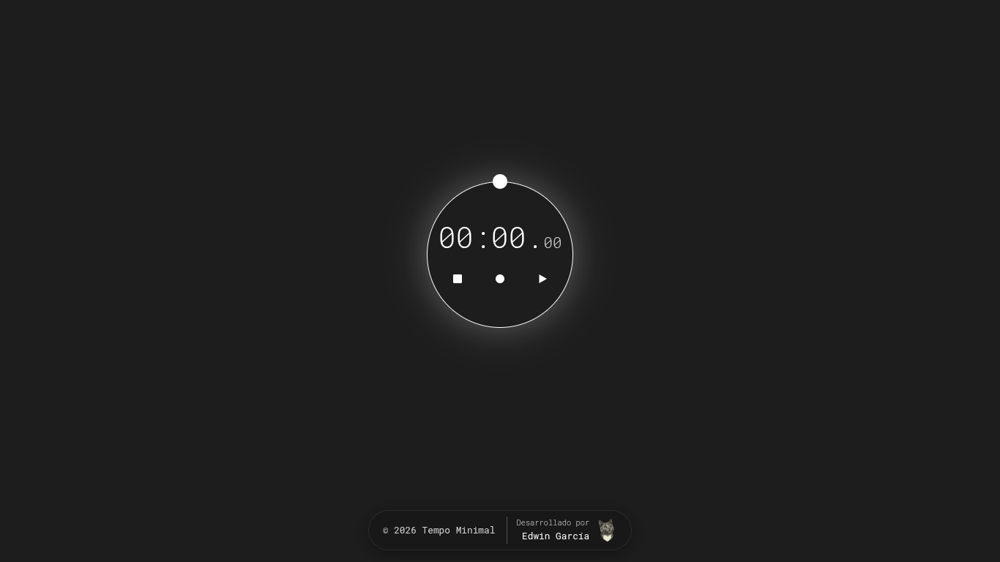

# Tempo Minimal ⏱️ | Cronómetro Minimalista

**Tempo Minimal** es una Progressive Web App (PWA) de alta precisión y diseño minimalista, creada para profesionales que buscan un flujo de trabajo enfocado y sin distracciones.

## 🖼️ Vista Previa del Sitio

<p align="center">
  
</p>

## 🚀 Tecnologías
* **HTML5:** Estructura semántica accesible con SVGs inline vectoriales.
* **CSS3:** Sistema de variables globales, animaciones a 60 FPS, scrollbar personalizado y diseño responsivo enfocado en *Touch Targets* móviles.
* **JavaScript (ES6+):** Estado centralizado, ciclo de renderizado sincronizado vía `requestAnimationFrame` y persistencia en `localStorage`.
* **PWA Tech:** Service Worker para funcionamiento offline e instalación nativa mediante `manifest.json`.

## ✨ Características Principales
* **Precisión y Fluidez:** Cálculo de delta de tiempo basado en `Date.now()` ejecutado mediante `requestAnimationFrame`.
* **Soporte Offline & PWA:** Totalmente funcional sin conexión a internet e instalable como app independiente.
* **Persistencia de Sesión:** Guarda automáticamente el tiempo acumulado, el estado de ejecución y el historial de vueltas tras recargar la página.
* **Historial de Vueltas (Laps):** Registro dinámico de marcas de tiempo con contenedor desplazable y estilizado.
* **Atajos de Teclado:** Control rápido mediante espacio (Play/Pause), `R` o `Esc` (Reiniciar) y `L` (Registrar vuelta).
* **Controles Táctiles Optimizados:** Botones escalados con área interactiva amplia para pantallas móviles.

## 🛠️ Estructura del Proyecto

```text
tempo-minimal/
├── assets/             # Iconos de PWA, favicon y branding personal
├── css/
│   └── style.css       # Estilos globales, variables CSS y responsive
├── js/
│   └── scripts.js      # Lógica del cronómetro, eventos y persistencia
├── index.html          # Estructura principal y controles SVG
├── manifest.json       # Configuración de PWA / Web App Manifest
├── sw.js               # Service Worker para almacenamiento en caché y soporte offline
├── LICENSE             # Licencia del proyecto (MIT)
└── README.md           # Documentación del proyecto
```

## 🧠 Lógica y Aprendizajes

Este proyecto sirvió como un ejercicio avanzado de **Ingeniería de Software Frontend**, destacando:

* **Gestión de Estado Centralizada:** Uso de un objeto `state` único como fuente de verdad para controlar el flujo de tiempo, animación e historial.
* **Optimización de Rendering (60 FPS):** Migración de `setInterval` a `requestAnimationFrame` para eliminar latencias de refresco de pantalla y reducir consumo de recursos.
* **Persistencia Eficiente:** Escritura controlada en `localStorage` sincronizada en pausar, reiniciar, registrar vuelta o cerrar la pestaña (`beforeunload`).
* **Iconografía SVG Inline:** Sustitución de *hacks* CSS por vectores SVG para asegurar escalabilidad y evitar distorsiones en cualquier densidad de pantalla.
* **Estrategia Cache-First:** Gestión de ciclo de vida del Service Worker (`install`, `activate`, `fetch`) asegurando actualización e instalación limpia.

## 📝 Licencia

Este proyecto está bajo la Licencia MIT. Consulta el archivo [LICENSE](LICENSE) para más detalles.

---
<p align="center">
  
  <br />
  <sub><b>Desarrollado por Edwin García</b> | 2026</sub>
</p>
